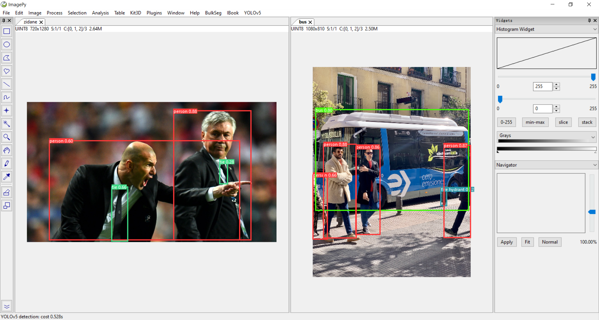
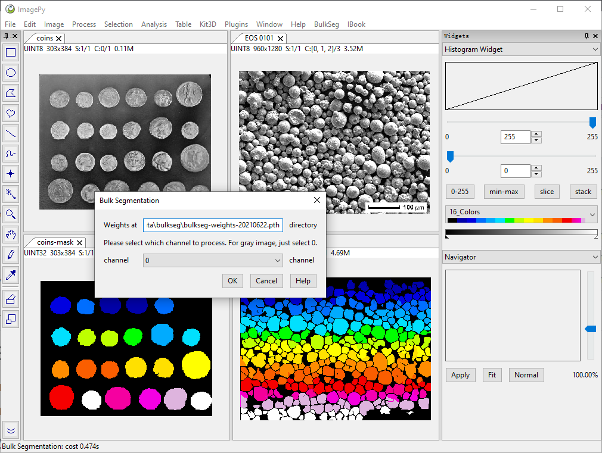

# OneButtonDeepLearning
This repo provides the Graphic User Interface for Deep Learning models to realize "One-button" to use these models.
In detail, it provides plugins in [imagepy](https://github.com/Image-Py/imagepy) to run the DL models.

# Usage
Just copy the model folder, and place it in the imagepy/plugins folder.
Then the menu for this model will appear in the imagepy menu bar.
## Attention
For some algorithms, you may need to download the pretrained weights file for the model. 
For the detaied information, please refer to the README document in the corresponding folder.

# Current available models

## YOLOv5
[YOLOv5](https://github.com/ultralytics/yolov5) is a family of compound-scaled object detection models trained on the COCO dataset.

## BulkSeg
[BulkSeg](BulkSeg/menus/BulkSeg/README.md) is a unified U-net algorithm for segmenting bulk-like objects.

