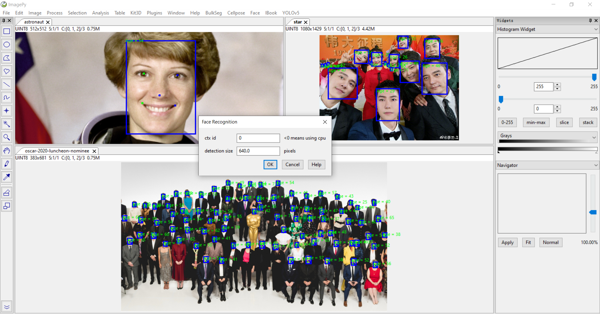
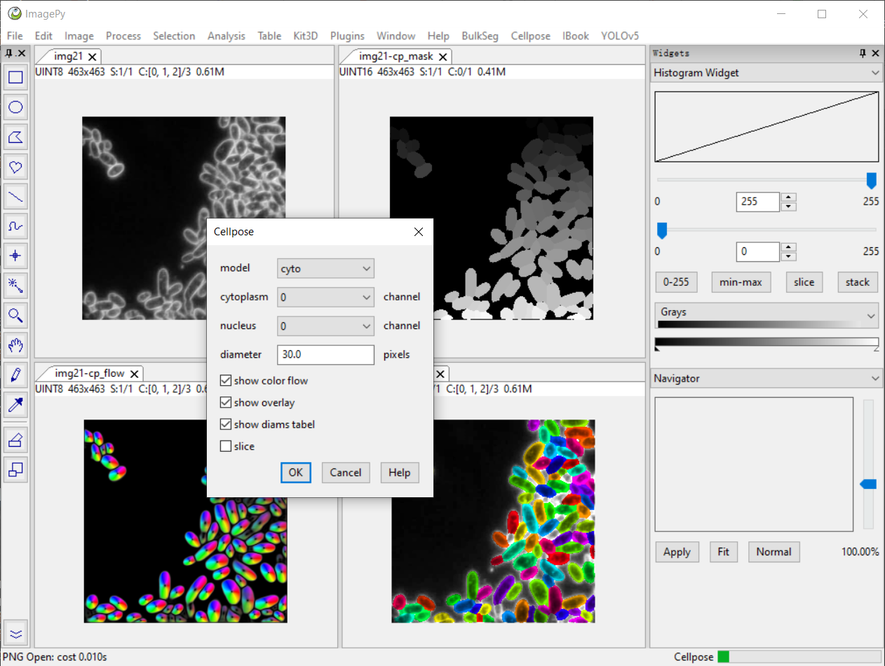

# OneButtonDeepLearning
This repo provides the Graphic User Interface for Deep Learning models to realize "One-button" to use these models.
In detail, it provides plugins in [imagepy](https://github.com/Image-Py/imagepy) to run the DL models.

# Usage
Just copy the model folder, and place it in the imagepy/plugins folder.
Then the menu for this model will appear in the imagepy menu bar.
只需将要使用的模型文件夹复制到imagepy/plugins文件夹下即可。
（目前版本还未自动安装模型依赖，如遇no module named xxx，只需pip install xxx即可）

# Current available models

## YOLOv5
[YOLOv5](https://github.com/ultralytics/yolov5) is a family of compound-scaled object detection models trained on the COCO dataset.

## Face Detection
[InsightFace](https://github.com/deepinsight/insightface) is an open source 2D&3D deep face analysis toolbox, and efficiently implements a rich variety of state of the art algorithms of face recognition, face detection and face alignment, which optimized for both training and deployment.

## Cellpose
[Cellpose](https://github.com/MouseLand/cellpose) is a generalist algorithm for cell and nucleus segmentation.

## BulkSeg
[BulkSeg](https://github.com/qixinbo/BulkSeg) which is inspired by Cellpose, is a fast and generalist algorithm for segmenting bulk-like objects.

