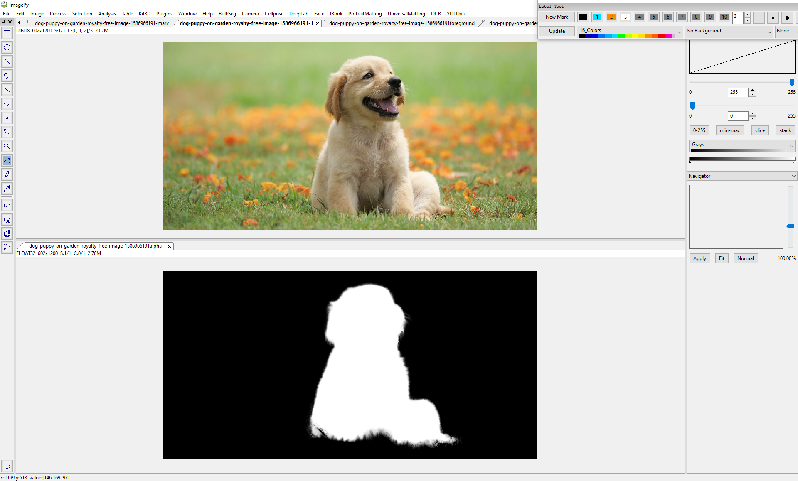
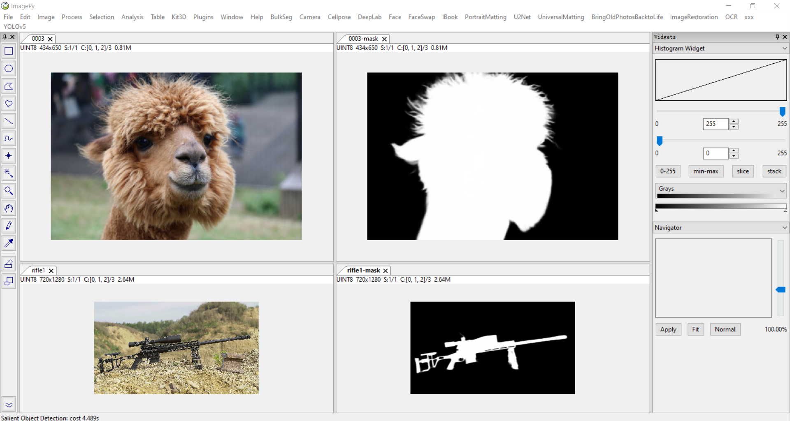
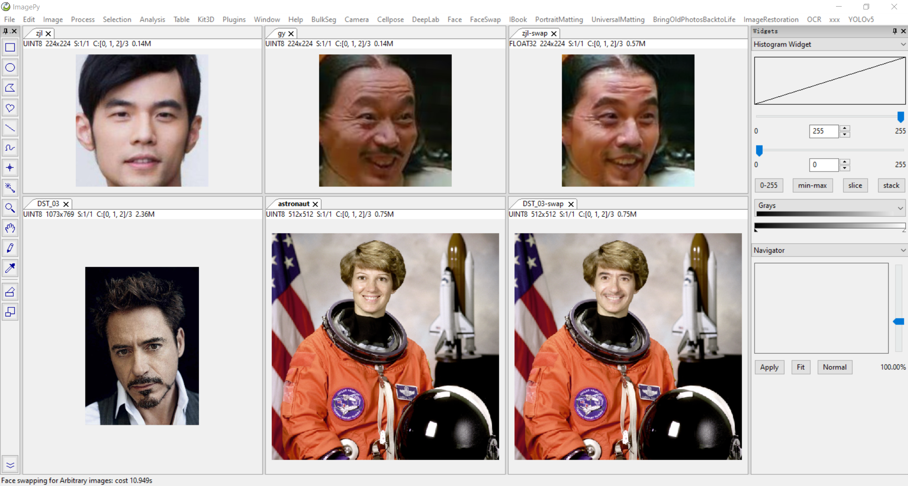
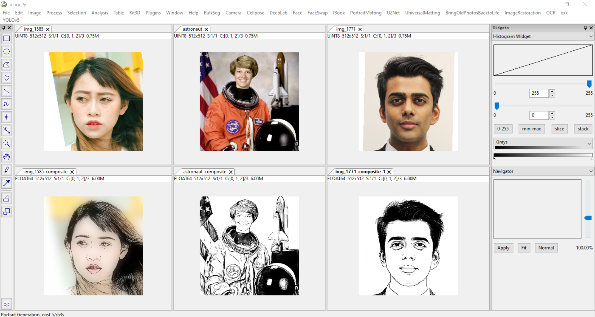
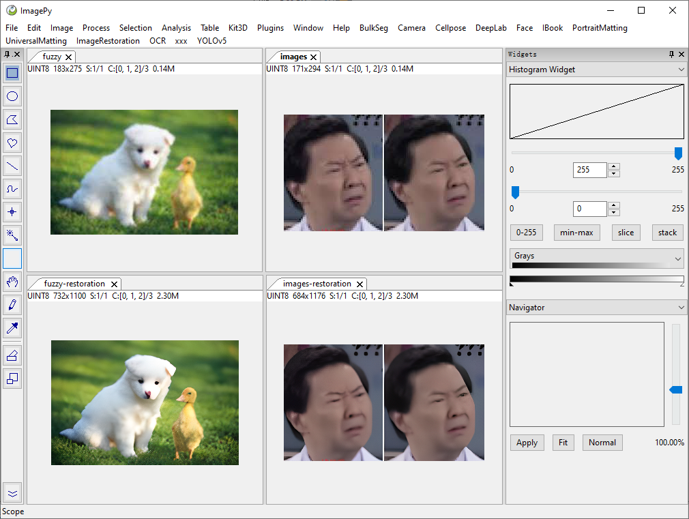
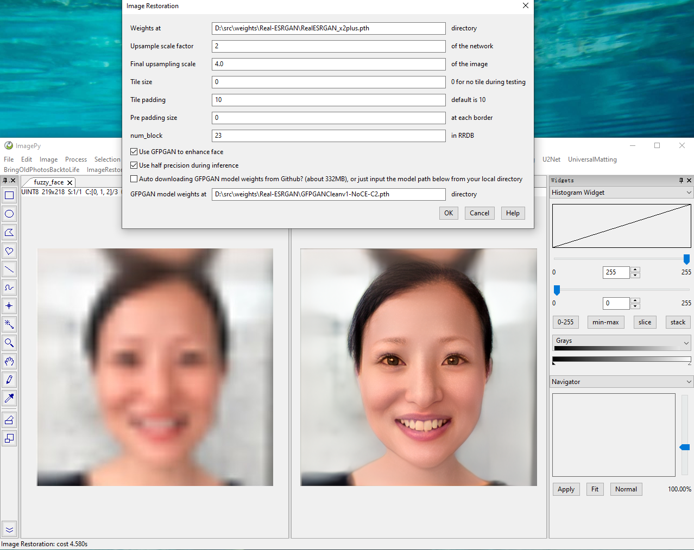
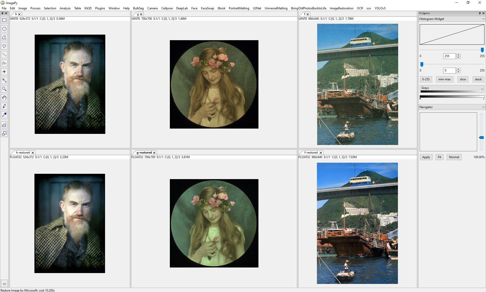
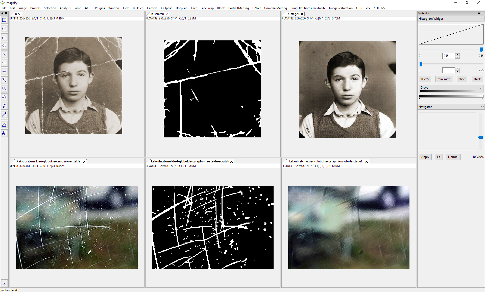
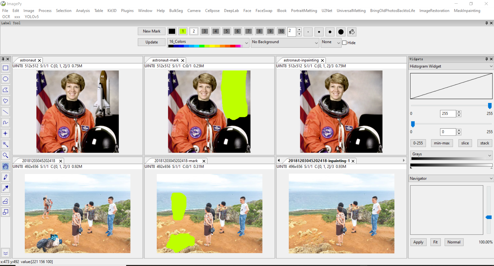

# OneButtonDeepLearning
This repo provides the Graphic User Interface for Deep Learning models to realize "One-button" to use these models.
In detail, it provides plugins in [ImagePy](https://github.com/Image-Py/imagepy) to run the DL models.

让深度学习算法触手可及、一键调用，不必每次在命令行进行复杂配置。

# Usage
Download the model folder, and place it in the `imagepy/plugins` folder.
Then the menu for this model will appear in the imagepy menu bar.

只需将要使用的模型文件夹复制到`imagepy/plugins`文件夹下，再次启动ImagePy后即可在菜单栏看到该算法。

## Optional 
If the environment is not configured for the model, just enter its `menus` folder, and run:
~~~~
pip install -r requirements.txt
~~~~ 

# Current available models

## OCR / 光学字符识别
[PaddleOCR](https://github.com/PaddlePaddle/PaddleOCR) aims to create multilingual, awesome, leading, and practical OCR tools that help users train better models and apply them into practice.

## YOLOv5 / 目标检测
[YOLOv5](https://github.com/ultralytics/yolov5) is a family of compound-scaled object detection models trained on the COCO dataset.

## Image Matting / 抠图

### Portrait Matting / 人物抠图
[RVM](https://github.com/PeterL1n/RobustVideoMatting) is specifically designed for robust human video matting. Unlike existing neural models that process frames as independent images, RVM uses a recurrent neural network to process videos with temporal memory. RVM can perform matting in real-time on any videos without additional inputs. It achieves 4K 76FPS and HD 104FPS on an Nvidia GTX 1080 Ti GPU.

### Universal Matting / 通用抠图
[FBA Matting](https://github.com/MarcoForte/FBA_Matting) is an interactive matting. It needs a trimap as an input, which can be easily realized with the ImagePy software.

### Salient Object Detection / 显著目标检测
[U2-Net](https://github.com/xuebinqin/U-2-Net) does not need a trimap to detect the salient object in the image.

## Face Detection / 人脸识别
[InsightFace](https://github.com/deepinsight/insightface) is an open source 2D&3D deep face analysis toolbox, and efficiently implements a rich variety of state of the art algorithms of face recognition, face detection and face alignment, which optimized for both training and deployment.

## Face Swap / 换脸
[SimSwap](https://github.com/neuralchen/SimSwap) is An Efficient Framework For High Fidelity Face Swapping.

## Portrait Generation / 人物素描
[U2-Net](https://github.com/xuebinqin/U-2-Net) can also be used for human portrait drawing.

## Cellpose / 胞状物体分割
[Cellpose](https://github.com/MouseLand/cellpose) is a generalist algorithm for cell and nucleus segmentation.

## Image Restoration / 图像重建
### Real-ESRGAN / 超分辨
[Real-ESRGAN](https://github.com/xinntao/Real-ESRGAN) aims at developing Practical Algorithms for General Image Restoration.

### Bringing Old Photos Back to Life / 超分辨 + 去划痕
[Old Photo Restoration](https://github.com/microsoft/Bringing-Old-Photos-Back-to-Life) is for Old Photo Restoration via Deep Latent Space Translation. It can be used to restore fuzzy images and even remove scratches.

## Mask Inpainting / 魔法消除
[LaMa](https://github.com/saic-mdal/lama) is Resolution-robust Large Mask Inpainting with Fourier Convolutions.

<!-- ## BulkSeg
[BulkSeg](https://github.com/qixinbo/BulkSeg) which is inspired by Cellpose, is a fast and generalist algorithm for segmenting bulk-like objects.

 -->
## DeepLab / 语义分割
[DeepLab](https://github.com/pytorch/vision/blob/master/torchvision/models/segmentation/deeplabv3.py) is a state-of-art deep learning model for semantic image segmentation, where the goal is to assign semantic labels (e.g., person, dog, cat and so on) to every pixel in the input image.
